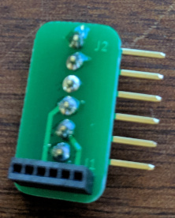
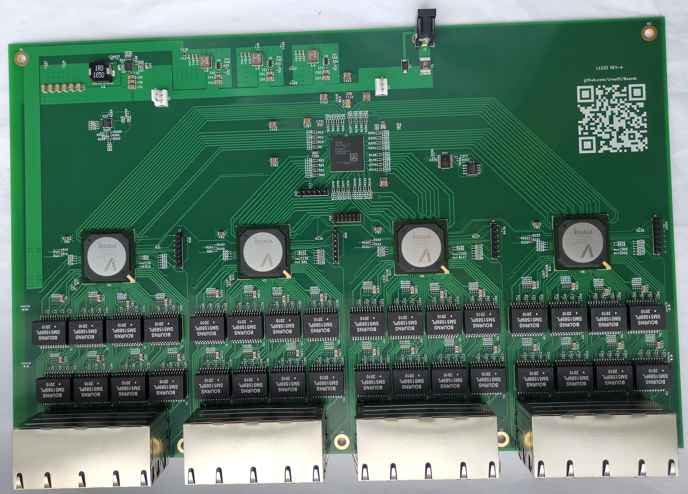

# Boards
1. [Pano G2 Debug Adapter](/PanoDebugAdapter) converts the 0.05" JTAG connector on these devices to 0.1" to connect to fly leads or other jumper wires.

 

2. [Layer 1 Switch](/L1Switch) is a L1 switch / virtual patch panel development board. This is useful for automated testing of equipment that needs different network topologies for various tests.

